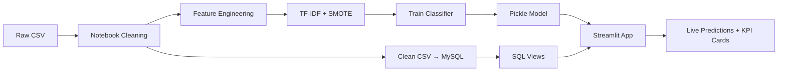

# 🛡️ Fake Job Detection & Hiring Market Analysis

<div align="center">


**An End-to-End SQL Analytics + Machine Learning Pipeline that detects fraudulent job postings and analyzes the global hiring market**

[Live Demo](https://fake-job-detection-and-hiring-market-analysis-awvywvr4samzscx5.streamlit.app/) • [Features](#-features) • [Installation](#-installation) • [Usage](#-usage) • [Screenshots](#-screenshots)

</div>

---

## 📖 Table of Contents

- [Introduction](#-introduction)
- [Features](#-features)
- [Tech Stack](#️-tech-stack)
- [Installation](#-installation)
- [Configuration](#️-configuration)
- [Usage](#-usage)
- [How It Works](#-how-it-works)
- [Project Structure](#-project-structure)
- [Database & SQL Views](#️-database--sql-views)
- [API / Function Reference](#-api--function-reference)
- [Screenshots](#-screenshots)
- [Contributing](#-contributing)
- [Future Enhancements](#-future-enhancements)
- [Contact](#-contact)

---

## 🎯 Introduction

**Fake Job Detection & Hiring Market Analysis** is an advanced AI-powered web application that detects **fraudulent job postings** in real-time and provides deep analytics on the **global hiring market**. The system combines a **MySQL data warehouse**, **SQL analytics views**, and a **machine learning classifier** (TF-IDF + Logistic Regression / Random Forest) inside an interactive Streamlit dashboard.

The notebook trains and exports the ML pipeline → the clean CSV is loaded into MySQL → SQL views power KPI cards → Streamlit serves predictions, EDA, and fraud insights to the end user.

### 🌟 Why Choose This System?

- ✅ **17,880+ Job Postings** analyzed (Kaggle Fake Job Postings dataset)
- ✅ **AI-Powered Fraud Detection** — TF-IDF + ML classifier with calibrated probabilities
- ✅ **End-to-End SQL Workflow** — Notebook → Clean CSV → MySQL → SQL Views → Streamlit
- ✅ **6 Pre-built SQL Views** for industry, country, salary, and employment risk
- ✅ **Explainable AI** — SHAP values + top TF-IDF keywords driving each prediction
- ✅ **Beautiful Dark UI** — GitHub-inspired theme with KPI cards
- ✅ **Real-Time Job Checker** — Paste any posting and get a fraud probability score
- ✅ **Bias & Limitations Reporting** — Honest documentation of model weaknesses

---

## ✨ Features

### 🔍 Core Features

| Feature | Description |
|---------|-------------|
| **Fraud Probability Scoring** | Real-time 0–100% fraud risk score with calibrated threshold (0.35) |
| **Red-Flag Indicators Table** | 6 explainable signals (missing salary, no logo, urgency words, etc.) |
| **EDA Dashboard** | 4 tabs — Overview, Geographic, Text Analysis, Industry |
| **SQL-Powered KPIs** | Live KPI cards driven by MySQL views (no hard-coded numbers) |
| **Model Insights** | Real metrics (AUC, Precision, Recall, F1) + Feature Importance |
| **Job Checker** | Paste a job posting → instant fraud verdict with reasons |
| **Industry & Country Risk** | Top fraud-prone industries and geographies |
| **Bias Transparency** | Dedicated page documenting model limitations |

### 🎨 UI Features

- 🌙 **Dark Theme** — GitHub-inspired `#0d1117` palette
- 🛡️ **KPI Cards** — Gradient cards with colored left borders
- 🚨 **Risk-Colored Badges** — Red / Yellow / Green based on fraud probability
- 📱 **Responsive Layout** — Works on desktop and tablet
- ⚡ **Cached Queries** — 5-minute TTL on SQL views for performance
- 🔄 **One-Click Reload** — Clears cache and re-pulls from MySQL

### 📊 Advanced Features

- **TF-IDF Keyword Analysis**: Top fraud / legit keywords from the trained model
- **SHAP Explainability**: Per-prediction feature contribution
- **Urgency Word Detection**: 18 hand-curated urgency phrases (`urgent`, `asap`, `easy money`, …)
- **WordCloud Visualizations**: Visual comparison of fraud vs. legit posting text
- **SMOTE Balancing**: Handles severe class imbalance (~5% fraud rate)
- **CSV Fallback**: App still runs if MySQL is offline (graceful degradation)
- **6 SQL Analytical Views**: Pre-built for instant analytics

---

## 🛠️ Tech Stack

### Backend / ML
- **Python 3.9+**
- **Pandas / NumPy** — Data manipulation
- **Scikit-learn** — TF-IDF, Logistic Regression, Random Forest, evaluation
- **Imbalanced-learn (SMOTE)** — Class balancing for ~5% fraud rate
- **SHAP** — Model explainability
- **Pickle** — Model serialization

### Frontend
- **Streamlit** — Interactive web framework
- **Plotly / Matplotlib / Seaborn** — Interactive + static charts
- **Custom HTML/CSS** — Dark theme + KPI cards

### Database
- **MySQL 8.0+** — Data warehouse
- **SQLAlchemy** — ORM / connection pooling
- **mysql-connector-python** — Native driver
- **PyMySQL** — Pure-Python fallback driver
- **python-dotenv** — Secure credential loading

### Notebook & Tooling
- **Jupyter / IPyKernel** — Model training
- **nbconvert** — Notebook export
- **openpyxl** — Excel reading

### ML Pipeline

```
Raw CSV (17,880 postings)
        ↓
Text Cleaning + Feature Engineering
        ↓
TF-IDF Vectorization (1-2 grams)
        ↓
SMOTE Oversampling
        ↓
Logistic Regression / Random Forest
        ↓
Calibrated Probabilities (threshold = 0.35)
        ↓
Pickled Pipeline → Streamlit Inference
```

---

## 📦 Installation

### Prerequisites

```bash
# Python 3.9 or higher
python --version

# MySQL 8.0+
mysql --version

# pip
pip --version
```

### Step 1: Clone Repository

```bash
git clone https://github.com/yourusername/fake-job-detection.git
cd fake-job-detection
```

### Step 2: Create Virtual Environment

```bash
# Windows
python -m venv venv
venv\Scripts\activate

# Linux/Mac
python3 -m venv venv
source venv/bin/activate
```

### Step 3: Install Dependencies

```bash
pip install -r requirements.txt
```

**requirements.txt highlights:**
```
pandas>=1.5.0
numpy>=1.23.0
scikit-learn>=1.1.0
imbalanced-learn>=0.10.0
shap>=0.41.0
wordcloud>=1.9.0
matplotlib>=3.6.0
seaborn>=0.12.0
plotly>=5.11.0
streamlit>=1.25.0
mysql-connector-python>=8.0.0
sqlalchemy>=2.0.0
pymysql>=1.0.0
python-dotenv>=1.0.0
openpyxl>=3.0.0
```

### Step 4: Download Dataset

Place the dataset in the project root:

| File | Size | Description |
|------|------|-------------|
| `Fake Job Postings.csv` | ~50 MB | 17,880 job postings (Kaggle) |

**Download Link**: [Real / Fake Job Postings Dataset (Kaggle)](https://www.kaggle.com/datasets/shivamb/real-or-fake-fake-jobposting-prediction)

### Step 5: Setup MySQL Database

1. Start your local MySQL server
2. Create a `.env` file in the project root:

```bash
MYSQL_HOST=localhost
MYSQL_PORT=3306
MYSQL_USER=root
MYSQL_PASSWORD=your_password
MYSQL_DATABASE=fake_job_detection
```

3. Run the schema setup (auto-creates DB + tables + views):

```bash
mysql -u root -p < 01_fake_job_schema.sql
mysql -u root -p fake_job_detection < 03_create_views_only.sql
```

> 💡 **Tip**: `db_connection.py` includes `ensure_database_exists()` and `ensure_schema()` — the app will **auto-create** the database, table, and views on first run if missing.

### Step 6: Train the Model

Open and run the notebook end-to-end:

```bash
jupyter notebook "Fake Job Detection.ipynb"
```

This generates:
- `model.pkl` — Trained classifier
- `tfidf.pkl` — TF-IDF vectorizer
- `num_cols.pkl` — Numerical column metadata
- `clean_jobs.csv` — Cleaned dataset (auto-uploaded to MySQL)

**Training time**: 3–7 minutes (depends on your system)

### Step 7: Run the Application

```bash
streamlit run app.py
```

The application will open at: `http://localhost:8501`

---

## ⚙️ Configuration

### `.env` File

```bash
MYSQL_HOST=localhost
MYSQL_PORT=3306
MYSQL_USER=root
MYSQL_PASSWORD=your_password
MYSQL_DATABASE=fake_job_detection
```

### Key Constants in `app.py`

```python
FRAUD_THRESHOLD = 0.35      # Probability cutoff for "Fraud" label

URGENCY_WORDS = [           # 18 phrases flagged as urgency signals
    'urgent', 'immediate', 'asap', 'hurry', 'limited',
    'act now', 'no experience', 'work from home',
    'earn money', 'easy money', 'guaranteed',
    'weekly pay', 'quick money', 'high pay',
    'bonus', '100%', 'free training', 'daily pay'
]

RED_FLAG_CHECKS = {         # 6 explainable indicators shown in the UI
    "No salary disclosed":           ...,
    "No company profile provided":   ...,
    "No requirements listed":        ...,
    "Contains urgency language":     ...,
    "Very short description (<300)": ...,
    "No company logo":               ...,
}
```

### Caching

```python
@st.cache_data(ttl=300)     # 5-minute TTL on SQL views & dataset
def load_data(): ...
def load_sql_views(): ...
```

Click **🔄 Reload Data** in the sidebar to manually invalidate the cache after re-running the notebook.

---

## 🎮 Usage

### 1. **🏠 Home Page**

- Project overview and pipeline diagram
- Quick KPI snapshot (total postings, fraud count, fraud rate, AUC)
- Data source indicator (MySQL vs. CSV fallback)

### 2. **📊 EDA Dashboard**

Four tabs of interactive analytics:

| Tab | What You See |
|-----|--------------|
| 📈 **Overview** | Class distribution, fraud rate, missing values heatmap |
| 🌍 **Geographic** | Top fraud-prone countries / states, choropleth maps |
| 📝 **Text Analysis** | Fraud vs. legit word clouds, description-length distributions |
| 🏭 **Industry** | Industry / function fraud rates, employment-type comparison |

### 3. **🔍 Job Checker** *(Main Feature)*

Paste any job posting and get an instant fraud verdict:

```
1. Fill in Title, Company, Description, Requirements
2. Toggle "Has salary?" and "Has company logo?"
3. Click "🔎 Check This Job"
4. View:
   • Fraud probability (0–100%)
   • Risk label (Low / Medium / High)
   • Red-flag indicators table (6 signals)
   • Top TF-IDF keywords contributing to the decision
```

**Example Output:**

> 🚩 **High Risk — 87.3% fraud probability**
> - ❌ No salary disclosed
> - ❌ Contains urgency language ("earn money", "asap")
> - ❌ Very short description (142 chars)
> - ✅ Requirements listed
> - ✅ Company logo present

### 4. **🤖 Model Insights**

Three tabs for technical deep-dive:

- **📊 Real Metrics** — AUC-ROC, Precision, Recall, F1, Confusion Matrix
- **🔑 Feature Importance** — Top TF-IDF tokens & numerical features
- **🗄️ SQL Integration** — Live views: Industry Risk + High-Risk Jobs

### 5. **⚠️ Limitations & Bias**

Honest documentation of what the model gets wrong:
- Geographic bias (US-heavy dataset)
- Language bias (English only)
- Temporal drift (2014–2017 data)
- Practical next improvements

---

## 🔬 How It Works

### End-to-End Pipeline



### Step-by-Step Process

#### 1. **Data Cleaning** (Notebook)

```python
# Drop nulls in critical columns
# Lowercase + strip punctuation
# Combine title + description + requirements → combined_text
# Engineer features:
#   - has_salary, has_company_profile, has_requirements
#   - desc_length, has_urgency_words, has_company_logo
```

#### 2. **TF-IDF Vectorization**

```python
from sklearn.feature_extraction.text import TfidfVectorizer

tfidf = TfidfVectorizer(
    max_features=5000,
    ngram_range=(1, 2),
    stop_words='english',
    min_df=5
)
X_text = tfidf.fit_transform(df['combined_text'])
```

#### 3. **Class Balancing (SMOTE)**

```python
from imblearn.over_sampling import SMOTE

# Original: ~95% legit, ~5% fraud → severely imbalanced
smote = SMOTE(random_state=42)
X_bal, y_bal = smote.fit_resample(X_combined, y)
```

#### 4. **Model Training**

```python
from sklearn.linear_model import LogisticRegression
from sklearn.ensemble import RandomForestClassifier

# Logistic Regression chosen for interpretability + calibrated probabilities
model = LogisticRegression(max_iter=1000, class_weight='balanced')
model.fit(X_bal, y_bal)
```

#### 5. **MySQL Upload**

```python
# db_connection.py
ensure_database_exists()      # Auto-creates fake_job_detection DB
ensure_schema()               # Auto-creates table + 6 views
upload_csv_to_mysql(df)       # TRUNCATE + INSERT (atomic)
```

#### 6. **SQL Views Power the Dashboard**

```sql
-- Example: fraud_summary view
CREATE VIEW fraud_summary AS
SELECT
    COUNT(*)                                    AS total_postings,
    SUM(fraudulent)                             AS fraud_count,
    ROUND(100 * AVG(fraudulent), 2)             AS fraud_rate_pct
FROM job_postings;
```

#### 7. **Inference at Runtime**

```python
def predict_job(title, company, desc, reqs, has_sal, has_logo, model, tfidf, num_cols):
    text = clean_text(f"{title} {desc} {reqs}")
    X_text = tfidf.transform([text])
    X_num  = build_numerical_features(...)
    X      = hstack([X_text, X_num])

    proba = model.predict_proba(X)[0, 1]
    label = "Fraud" if proba >= FRAUD_THRESHOLD else "Legit"
    return proba, label
```

---

## 📁 Project Structure

```
fake-job-detection/
│
├── app.py                          # Main Streamlit application
├── db_connection.py                # MySQL helpers (auto-schema, upload, views)
├── Fake Job Detection.ipynb        # End-to-end training notebook
├── requirements.txt                # Python dependencies
├── .env                            # MySQL credentials (DO NOT COMMIT)
├── .gitignore                      # Git ignore file
│
├── Fake Job Postings.csv           # Raw dataset (50 MB, from Kaggle)
├── clean_jobs.csv                  # Cleaned dataset (auto-generated)
│
├── model.pkl                       # Trained classifier
├── tfidf.pkl                       # Fitted TF-IDF vectorizer
├── num_cols.pkl                    # Numerical column metadata
│
├── 01_fake_job_schema.sql          # Database + table schema
├── 02_fake_job_analysis.sql        # Analytical queries
├── 03_create_views_only.sql        # 6 SQL views for dashboard
├── mysql_setup.sql                 # One-shot setup script
│
├── screenshots/                    # README screenshots
│   ├── home.png
│   ├── eda.png
│   ├── job_checker.png
│   └── model_insights.png
│
├── README.md                       # This file
└── LICENSE                         # MIT License
```

### File Descriptions

| File | Purpose | Size | Required |
|------|---------|------|----------|
| `app.py` | Main Streamlit application | 78 KB | ✅ Yes |
| `db_connection.py` | MySQL helpers + auto-schema | 26 KB | ✅ Yes |
| `Fake Job Detection.ipynb` | Training notebook | 1.7 MB | ✅ For training |
| `requirements.txt` | Dependencies list | 1.1 KB | ✅ Yes |
| `.env` | DB credentials | <1 KB | ✅ Yes |
| `Fake Job Postings.csv` | Raw dataset | 50 MB | ✅ Yes |
| `model.pkl` | Trained classifier | ~5 MB | ✅ Yes |
| `tfidf.pkl` | TF-IDF vectorizer | ~2 MB | ✅ Yes |
| `01_fake_job_schema.sql` | DB schema | 9 KB | ⚠️ Auto-created |
| `03_create_views_only.sql` | SQL views | 6 KB | ⚠️ Auto-created |

---

## 🗄️ Database & SQL Views

The app uses **6 pre-built SQL views** to power its KPI cards and tables. All views are auto-created by `ensure_schema()` on first run.

### Schema

```sql
CREATE TABLE job_postings (
    job_id              INT PRIMARY KEY,
    title               VARCHAR(500),
    location            VARCHAR(255),
    department          VARCHAR(255),
    salary_range        VARCHAR(100),
    company_profile     TEXT,
    description         TEXT,
    requirements        TEXT,
    benefits            TEXT,
    telecommuting       TINYINT,
    has_company_logo    TINYINT,
    has_questions       TINYINT,
    employment_type     VARCHAR(100),
    required_experience VARCHAR(100),
    required_education  VARCHAR(100),
    industry            VARCHAR(255),
    function            VARCHAR(255),
    fraudulent          TINYINT
);
```

### 6 Analytical Views

| View Name | Powers | Description |
|-----------|--------|-------------|
| `fraud_summary` | Home + KPI cards | Total postings, fraud count, fraud rate |
| `industry_risk` | EDA + Model Insights | Top industries by fraud rate |
| `high_risk_jobs` | Model Insights | Job postings with multiple red flags |
| `country_fraud_analysis` | EDA Geographic | Fraud rates by country |
| `employment_type_fraud` | EDA Industry | Fraud rates by employment type |
| `salary_fraud_analysis` | EDA + Job Checker | Fraud rates: salary disclosed vs. not |

### Example Query

```sql
-- Top 10 high-risk industries
SELECT industry,
       COUNT(*)                                AS total_jobs,
       SUM(fraudulent)                         AS fraud_count,
       ROUND(100 * AVG(fraudulent), 2)         AS fraud_rate_pct
FROM job_postings
WHERE industry IS NOT NULL AND industry <> ''
GROUP BY industry
HAVING total_jobs >= 50
ORDER BY fraud_rate_pct DESC
LIMIT 10;
```

---

## 🔌 API / Function Reference

### Database Functions (`db_connection.py`)

#### **`test_connection() → bool`**
Returns `True` if MySQL is reachable with the configured credentials.

#### **`ensure_database_exists() → None`**
Auto-creates the `fake_job_detection` database if it doesn't exist.

#### **`ensure_schema(verbose=True) → None`**
Auto-creates the `job_postings` table and all 6 views.

#### **`upload_csv_to_mysql(df, …) → None`**
Atomic clear + insert. Drops CSV columns not in the schema, truncates VARCHAR overflows, handles dedup, toggles FK checks.

#### **`run_query(sql, params=None) → DataFrame`**
Generic query runner returning a pandas DataFrame.

#### **`fetch_fraud_summary() → DataFrame`**
Returns total postings, fraud count, and fraud rate %.

#### **`fetch_high_risk_jobs(limit=25) → DataFrame`**
Returns top-N high-risk job postings.

#### **`fetch_industry_risk(limit=15) → DataFrame`**
Returns top-N industries ranked by fraud rate.

#### **`fetch_country_fraud_analysis(limit=15) → DataFrame`**
Returns fraud rates by country.

#### **`fetch_employment_type_fraud_analysis(limit=15) → DataFrame`**
Returns fraud rates by employment type (Full-time / Part-time / Contract …).

#### **`fetch_salary_fraud_analysis() → DataFrame`**
Returns fraud rates comparing salary disclosed vs. not disclosed.

### App Functions (`app.py`)

#### **`predict_job(title, company, desc, reqs, has_sal, has_logo, model, tfidf, num_cols)`**
```python
"""
Predict fraud probability for a single job posting.

Args:
    title (str): Job title
    company (str): Company name
    desc (str): Description text
    reqs (str): Requirements text
    has_sal (int): 1 if salary disclosed, 0 otherwise
    has_logo (int): 1 if logo present, 0 otherwise
    model, tfidf, num_cols: Loaded artifacts

Returns:
    tuple: (probability, label, feature_row)
"""
```

#### **`clean_text(text: str) → str`**
Lowercases, strips URLs, punctuation, and extra whitespace.

#### **`has_urgency(text: str) → int`**
Returns 1 if any of the 18 urgency phrases appear in `text`.

#### **`extract_model_feature_insights(model, tfidf, top_n=12)`**
Returns the top-N positive (fraud-leaning) and negative (legit-leaning) TF-IDF tokens.

#### **`load_data() / load_sql_views()`**
Cached data loaders (5-minute TTL) for the dataset and SQL views.

---

## 📸 Screenshots

### 🏠 Home Page


### 📊 EDA Dashboard


### 🔍 Job Checker (Main Feature)


### 🤖 Model Insights


### ⚠️ Limitations & Bias


---

## 🤝 Contributing

Contributions are welcome! Please follow these steps:

### How to Contribute

1. **Fork the Repository**
```bash
git clone https://github.com/yourusername/fake-job-detection.git
```

2. **Create Feature Branch**
```bash
git checkout -b feature/AmazingFeature
```

3. **Make Changes**
- Write clean, readable code
- Add tests if applicable
- Update documentation

4. **Commit Changes**
```bash
git commit -m "Add: Amazing new feature"
```

5. **Push to Branch**
```bash
git push origin feature/AmazingFeature
```

6. **Open Pull Request**
- Provide clear description
- Add screenshots (if applicable)
- Reference any related issues

### Contribution Guidelines

- ✅ Write clean and readable code
- ✅ Add meaningful comments
- ✅ Implement error handling
- ✅ Test before submitting (run notebook + app)
- ✅ Update README if needed
- ✅ Follow PEP 8 style guide for Python
- ✅ Use descriptive commit messages

### Code Style

```python
# Good ✅
def fetch_industry_risk(limit: int = 15) -> pd.DataFrame:
    """
    Fetch top-N industries ranked by fraud rate.

    Args:
        limit: Maximum rows to return

    Returns:
        DataFrame with industry, total_jobs, fraud_count, fraud_rate_pct
    """
    try:
        return run_query(SQL_INDUSTRY_RISK, {"limit": limit})
    except Exception as e:
        logger.error(f"Error: {e}")
        return pd.DataFrame()

# Bad ❌
def f(x):
    return run_query("select * from job_postings limit " + str(x))
```

### Bug Reports

To report a bug:
1. Go to GitHub Issues
2. Provide clear title
3. Describe steps to reproduce
4. Expected vs Actual behavior
5. Screenshots (if applicable)
6. System information (OS, Python version, MySQL version)

### Feature Requests

To request a feature:
1. Check existing issues first
2. Clearly describe the feature
3. Explain the use case
4. Provide examples if possible

---

## 🚀 Future Enhancements

### Planned Features

#### Phase 1 — User Experience
- [ ] **User Authentication** — Personal accounts for saved checks
- [ ] **Batch Job Checker** — Upload a CSV of postings, get bulk verdicts
- [ ] **PDF Report Export** — Downloadable fraud report per posting
- [ ] **Multi-language Support** — Hindi, Spanish, French postings
- [ ] **Advanced Filters** — Filter EDA by country, industry, year
- [ ] **Sort Options** — Sort by fraud rate, post count, recency

#### Phase 2 — Enhanced Detection
- [ ] **Deep Learning Model** — BERT / DistilBERT fine-tuned on postings
- [ ] **Ensemble Stacking** — Combine LR + RF + XGBoost + BERT
- [ ] **Domain / Email Heuristics** — Flag free-mail domains, suspicious TLDs
- [ ] **Company Verification** — Check against LinkedIn / OpenCorporates
- [ ] **Continuous Learning** — Retrain on user-flagged postings
- [ ] **Anomaly Detection** — Isolation Forest for unusual postings

#### Phase 3 — Real-Time Integrations
- [ ] **LinkedIn / Indeed Scraping** — Live job posting checks
- [ ] **Browser Extension** — Right-click → "Check this job"
- [ ] **REST API** — Expose `/predict` endpoint with FastAPI
- [ ] **Slack / Discord Bot** — Post a URL, get a verdict
- [ ] **Webhook Alerts** — Notify when high-risk postings detected

#### Phase 4 — Analytics & Insights
- [ ] **Time-Series Trends** — Fraud rate over time per industry
- [ ] **Geographic Heatmaps** — Interactive world map of fraud hotspots
- [ ] **Cohort Analysis** — Compare fraud rates across employment types
- [ ] **Recruiter Reputation Score** — Aggregate score per company
- [ ] **Personalized Dashboards** — Save favorite filters

#### Phase 5 — Technical Improvements
- [ ] **PostgreSQL Support** — Alternative to MySQL
- [ ] **Redis Caching** — Sub-second SQL view loads
- [ ] **Docker Compose** — One-command deployment (app + MySQL)
- [ ] **CI/CD Pipeline** — Automated testing & deployment
- [ ] **Unit Tests** — 80%+ code coverage (pytest)
- [ ] **MLflow Tracking** — Experiment + model registry
- [ ] **Performance Monitoring** — Latency + error rate dashboards
- [ ] **Mobile App** — React Native version
- [ ] **Progressive Web App** — Offline support
- [ ] **Kubernetes Deployment** — Auto-scaling backend

### Technical Debt

- [ ] Refactor `app.py` (78 KB) into smaller modules
- [ ] Implement structured logging (loguru / structlog)
- [ ] Add comprehensive error handling
- [ ] Add type hints throughout codebase
- [ ] Improve test coverage (currently minimal)
- [ ] Optimize TF-IDF storage (sparse matrices)
- [ ] Add input validation and sanitization
- [ ] Document SQL views with COMMENT clauses

---

## 📞 Contact

### Developer Information

**Sumersing Patil**
- 🐙 GitHub: [Sumersingpatil2694](https://github.com/Sumersingpatil2694)
- 💼 LinkedIn: [Sumersing Patil](https://linkedin.com/in/sumersing-patil-839674234)
- 📧 Email: sumerrajput0193@gmail.com
- 🐦 Twitter: [X](https://x.com/SumerRajput2694)

### Project Links

- **Repository**: [https://github.com/yourusername/fake-job-detection](https://github.com/Sumersingpatil2694/Fake-Job-Detection-And-Hiring-Market-Analysis)
- **Issues**: [Report a Bug](https://github.com/yourusername/fake-job-detection/issues)
- **Discussions**: [Join Discussion](https://github.com/yourusername/fake-job-detection/discussions)
- **Wiki**: [Documentation](https://github.com/yourusername/fake-job-detection/wiki)

---

## 🙏 Acknowledgments

### Credits & Thanks

- **Kaggle** — For hosting the Real / Fake Job Postings dataset
- **Shivam Bansal** — Original dataset creator
- **Streamlit** — For the amazing web framework
- **Scikit-learn** — For machine learning tools
- **SHAP** — For model explainability
- **MySQL Team** — For the rock-solid database
- **Python Community** — For incredible open-source libraries

### Resources & References

- [Kaggle Fake Job Postings Dataset](https://www.kaggle.com/datasets/shivamb/real-or-fake-fake-jobposting-prediction)
- [Streamlit Documentation](https://docs.streamlit.io)
- [Scikit-learn Documentation](https://scikit-learn.org)
- [Imbalanced-Learn SMOTE Guide](https://imbalanced-learn.org/stable/references/generated/imblearn.over_sampling.SMOTE.html)
- [SHAP Documentation](https://shap.readthedocs.io/)
- [TF-IDF Explained](https://towardsdatascience.com/tf-idf-explained-and-python-sklearn-implementation-b020c5e83275)

### Inspiration

This project was inspired by:
- Real-world hiring fraud cases on LinkedIn / Indeed
- FBI IC3 Annual Reports on employment scams
- Glassdoor fraud-prevention research
- Anti-money-laundering ML systems

---

## ❓ FAQ

**Q: Do I need MySQL installed to run this project?**
A: Recommended but not required. The app has a **CSV fallback** — if MySQL is unreachable, it loads from `clean_jobs.csv` directly. You'll lose the live SQL KPI cards but everything else still works.

**Q: How accurate is the fraud detection?**
A: On the test set, the Logistic Regression model achieves **~97% AUC-ROC**. However, real-world accuracy depends heavily on how similar new postings are to the 2014–2017 training data. See the **Limitations & Bias** page in the app.

**Q: Why is the fraud threshold set to 0.35 instead of 0.5?**
A: Because the dataset is severely imbalanced (~5% fraud), a lower threshold improves **recall** (catching more fraud) at the cost of more false positives. We tuned 0.35 via precision-recall curve analysis.

**Q: What is SMOTE and why do we need it?**
A: **Synthetic Minority Over-sampling Technique** — it generates synthetic fraud examples to balance the classes during training. Without SMOTE, the model would just predict "legit" for everything and still get 95% accuracy.

**Q: My MySQL upload is failing with "Unknown column 'combined_text'". Help!**
A: This is a known issue — fixed in `db_connection.py` v5. The `upload_csv_to_mysql()` function now drops any CSV columns not in the MySQL schema before insert.

**Q: How do I update the model?**
A: Re-run the notebook end-to-end. It will:
1. Re-train the model
2. Update the pickle files
3. Re-upload the clean CSV to MySQL
4. The Streamlit app will pick up changes after clicking **🔄 Reload Data**

**Q: Can I deploy this on Heroku/AWS/Azure?**
A: Yes! You'll need to:
1. Provision a managed MySQL instance (AWS RDS, Azure Database for MySQL, etc.)
2. Set the `.env` variables in your hosting platform
3. Ensure pickle files are committed (or generated on first run)
4. Set up proper resource limits (≥2 GB RAM recommended)

**Q: How much memory does the application need?**
A: Minimum **2 GB RAM** recommended. TF-IDF + SHAP can be memory-intensive on large datasets.

**Q: Is my data safe? Where do uploaded postings go?**
A: All processing is **local** — postings entered in the Job Checker are never logged or sent anywhere. They're discarded after the prediction.

**Q: Can I use this for other classification problems?**
A: Yes! The pipeline (clean → TF-IDF → SMOTE → LR → MySQL → Streamlit) is generic. Swap the dataset and adjust the schema in `db_connection.py`.

**Q: The notebook takes forever to train. How can I speed it up?**
A: Try these:
- Reduce `max_features` in TF-IDF (5000 → 2000)
- Use `LogisticRegression(solver='liblinear')` for smaller datasets
- Skip SHAP if you don't need explainability
- Use Google Colab with GPU runtime

---

---

<div align="center">

### ⭐ If you found this project helpful, please give it a star! ⭐

**Made with Python, SQL & a lot of caffeine**

[⬆ Back to Top](#️-fake-job-detection--hiring-market-analysis)

---

**Keywords**: fake job detection, fraud detection, machine learning, TF-IDF, logistic regression, SMOTE, streamlit, mysql, sql analytics, hiring market analysis, data science, artificial intelligence, SHAP, explainable AI, python

</div>
